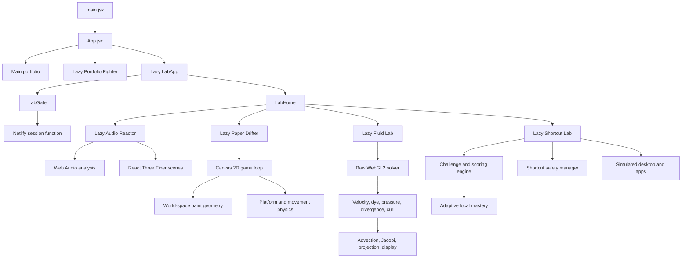

# Priitivi — Creative Developer Portfolio

An interactive developer portfolio built as a collection of playable interfaces, real-time simulations, and experimental web experiences.

The site combines a clear editorial portfolio with a 3D combat experience and a protected laboratory containing audio-reactive visuals, platform games, a GPU fluid simulation, and an interactive shortcut-training desktop.

**Live site:** [priitivi.com](https://priitivi.com)

---

## Overview

This repository contains three connected parts:

### Main portfolio

A responsive editorial portfolio focused on presenting projects, experience, skills, and contact information clearly.

Highlights include:

- Animated landing page and project case studies
- Biography, CV download, and contact form
- Responsive navigation and accessible layouts
- Crashed-UFO portal into Priit's Lab
- Lazy-loaded entry into Portfolio Fighter

### Portfolio Fighter

A playable 3D portfolio experience built around a boss battle.

Features include:

- Character customisation
- Configurable clothing, appearance, and weapon
- Comic-style story introduction
- Procedural 3D combat arena
- Attacks, dodging, health phases, and boss encounters
- Portfolio content unlocked between combat phases
- Keyboard and touch controls

### Priit's Lab

Priit's Lab is a protected route at `/lab` containing five interactive experiments. Each experience is lazy-loaded so it does not affect the initial portfolio bundle.

| Experiment | Description |
| --- | --- |
| **Psychedelic Audio Reactor** | Upload a local audio track and transform waveform, frequency, stereo, and beat data into four real-time visual systems. |
| **The Paper Drifter** | Explore a hand-crafted 2D paper world where drawn strokes become physical platforms and colour restores lost landmarks. |
| **Fluid Lab** | Interact with a pressure-solved GPU fluid simulation using mouse, pen, or touch input, configurable palettes, and live solver controls. |
| **Shortcut Lab** | Learn practical productivity shortcuts inside a simulated desktop containing fake browser, editor, terminal, files, mail, notes, and spreadsheet applications. |
| **The Deceptive Trial** | Survive a data-driven platform campaign whose rules, traps, and expectations shift across twelve increasingly tense levels. |

---

## Featured experiments

### Psychedelic Audio Reactor

A Web Audio and React Three Fiber experiment that turns a local audio file into a reactive visual environment.

The analysis pipeline measures:

- Waveform amplitude
- Sub-bass, bass, mid, and treble energy
- Spectral centroid
- Stereo balance
- Beat impulses

The analyser writes high-frequency values into mutable refs rather than React state. React Three Fiber scenes read those values from the render loop, avoiding unnecessary component rerenders.

### The Paper Drifter

A 2D platforming experiment rendered with the Canvas API.

The player explores a 5,400-pixel paper world where drawing is part of the level design:

1. Pointer coordinates are converted into persistent world-space strokes.
2. Strokes are rendered using layered ink, pigment, and highlight passes.
3. Suitable line segments become walkable platforms and ramps.
4. Painted regions restore colour to four landmarks in any order.

The game also includes jumping, coyote time, dashing, particles, touch controls, camera movement, and a selectable local soundtrack.

### Fluid Lab

A raw WebGL2 fluid simulation with a multi-pass GPU solver.

Each animation frame performs:

1. Pointer dye and momentum splats
2. Curl calculation
3. Vorticity confinement
4. Divergence calculation
5. Ping-pong Jacobi pressure iterations
6. Pressure-gradient subtraction
7. Velocity advection
8. Dye advection and dissipation
9. Tone-mapped display shading

The simulation includes adaptive quality, aspect-aware framebuffer sizing, reduced-motion support, fullscreen controls, six palettes, and graceful WebGL fallback messaging.

### Shortcut Lab

A browser-based productivity training game inspired by typing trainers, but focused on real keyboard shortcuts and contextual workflows.

The user works inside a contained simulated desktop with:

- Draggable, resizable, focusable, and minimisable windows
- Fake browser
- Fake code editor
- Fake terminal
- Fake file explorer
- Fake mail
- Fake notes
- Fake spreadsheet
- Dock, launcher, clock, fullscreen, settings, and pause controls

Shortcut Lab includes:

- 42 data-driven challenges
- Tutorial mode
- Adaptive practice
- Timed sprint sessions
- Three multi-application workflows
- Deterministic daily challenges
- Scoring, combos, accuracy, and reaction-time tracking
- Local mastery and progress persistence
- Windows/Linux and macOS labels
- Virtual keyboard support
- Reduced-motion, sound, and accessibility settings
- Mobile fallback

Reserved browser and operating-system shortcuts are never relied on as unsafe physical inputs. Where necessary, the real shortcut is shown while the action is practised through a virtual keyboard or clearly labelled training substitute.

### The Deceptive Trial

The Deceptive Trial is a Canvas 2D platform campaign at `/lab/deceptive-trial`. React owns interface state while `GameEngine` runs a fixed physics step and display-rate renderer. Its data-driven levels combine moving platforms, hazards, checkpoints, secrets, gravity changes, mirrored input, fake exits, and other expectation traps.

Movement includes acceleration, coyote time, jump buffering, variable jump height, camera look-ahead, landing feedback, and instant checkpoint respawns. Camera shake uses clamped impact presets: landings are nearly imperceptible, checkpoints subtle, deaths moderate, and major world changes strongest. Reduced-shake mode and the operating system's reduced-motion preference disable the offset without affecting gameplay cues.

Audio cues and an adaptive four-act storybook score are synthesized with Web Audio. A recurring music-box motif gains rhythmic density and tension over the campaign, while deterministic variations and effect ducking avoid an overly repetitive loop. No audio files with unverified redistribution rights are used.

See [The Deceptive Trial engineering guide](src/lab/deceptive-trial/README.md) for engine, level-authoring, accessibility, audio, and performance details.

---

## Tech stack

| Layer | Technology | Purpose |
| --- | --- | --- |
| UI | React 19 | Components, screens, and application state |
| Build | Vite 6 | Development server, code splitting, and production builds |
| 3D | Three.js and React Three Fiber | Characters, arenas, shaders, particles, and 3D game loops |
| 2D | Canvas 2D API | Paper-world rendering, drawing, particles, and platform physics |
| GPU simulation | WebGL2 and GLSL ES 3.0 | Fluid fields, shader passes, advection, pressure, and display rendering |
| Motion | Framer Motion | Portfolio transitions and interface animation |
| Styling | Tailwind CSS and custom CSS | Responsive layout and bespoke visual systems |
| Audio | Web Audio API | Frequency analysis, waveform energy, stereo balance, and beat detection |
| Forms | React Hook Form | Contact form state and validation |
| Authentication | Netlify Functions and Node crypto | Password verification and signed Lab sessions |
| Testing | Node test runner | Security, simulation helpers, challenge logic, and gameplay utilities |
| Hosting | Netlify | Static hosting, serverless Functions, and SPA redirects |

---

## Architecture



The application intentionally avoids a full routing dependency. `App.jsx` delegates `/lab` paths to `LabApp`, which manages nested Lab navigation with the History API.

Expensive experiences are imported through `React.lazy`, keeping them outside the initial portfolio bundle.

---

## Project structure

```text
Portfolio/
├── netlify/
│   └── functions/
│       ├── lab-session.mjs
│       └── _shared/
│           └── lab-security.mjs
├── public/
│   └── audio/
├── scripts/
│   └── hash-lab-password.mjs
├── src/
│   ├── components/
│   ├── data/
│   ├── game/
│   │   ├── GameExperience.jsx
│   │   ├── ArenaScene.jsx
│   │   └── game.css
│   ├── lab/
│   │   ├── auth/
│   │   ├── audio-reactor/
│   │   ├── paint-surfer/
│   │   ├── fluid-lab/
│   │   ├── shortcut-lab/
│   │   │   ├── apps/
│   │   │   ├── components/
│   │   │   ├── core/
│   │   │   ├── data/
│   │   │   ├── ShortcutLab.jsx
│   │   │   └── shortcut-lab.css
│   │   ├── LabApp.jsx
│   │   └── LabHome.jsx
│   ├── App.jsx
│   ├── main.jsx
│   └── index.css
├── tests/
├── netlify.toml
├── package.json
└── vite.config.js
```

---

## Lab authentication

The Lab password is never included in the browser bundle.

A Netlify Function receives the submitted password and compares it with a salted scrypt hash using timing-safe verification. A successful login returns a signed, short-lived cookie configured with:

- `HttpOnly`
- `Secure` in production
- `SameSite=Strict`
- 30-minute expiry

The Lab gate controls access to the route, but it is not a secrecy boundary for compiled frontend code. Confidential information should never be placed in a static client bundle.

---

## Shortcut safety model

Shortcut Lab classifies shortcuts as:

- `safe`
- `browser-reserved`
- `os-reserved`

Browser and operating-system shortcuts remain under the control of the browser or OS. The lab does not claim it can block every reserved chord.

Safe shortcuts are handled inside the simulation. Reserved shortcuts are displayed accurately but trained through labelled alternatives or the clickable virtual keyboard.

| Action | Real shortcut | Lab training input |
| --- | --- | --- |
| Focus address bar | `Ctrl/Cmd + L` | `Ctrl/Cmd + Alt/Option + Shift + L` |
| Restore closed tab | `Ctrl/Cmd + Shift + T` | `Ctrl/Cmd + Alt/Option + Shift + R` |
| Next or previous tab | `Ctrl/Cmd + Tab` / `Ctrl/Cmd + Shift + Tab` | `Alt/Option + Shift + Right/Left` |
| Close or open tab | `Ctrl/Cmd + W` / `Ctrl/Cmd + T` | `Ctrl/Cmd + Alt/Option + Shift + W/N` |
| Switch application | `Alt/Option + Tab` | `Ctrl/Cmd + Alt/Option + Shift + A` |
| Show desktop | `Win + D` | `Ctrl/Cmd + Alt/Option + Shift + D` |

Inputs, textareas, selects, and editable regions are excluded from the global challenge listener. Timers and keyboard listeners are removed when the experience pauses or unmounts.

---

## Performance strategy

The interactive experiences are designed to avoid adding unnecessary work to the normal portfolio.

- Lab experiments are split into route-level lazy chunks.
- Three.js quality settings lower shadows, particles, geometry, and pixel ratio on weaker devices.
- Audio analysis writes to refs instead of rerendering React components at audio frequency.
- Paper Drifter caps device pixel ratio, particles, stroke count, and points per stroke.
- Physics samples recent paint geometry rather than scanning all historical strokes.
- Fluid simulation buffers scale independently from display resolution.
- Fluid Lab can reduce quality after sustained slow frame times.
- Hidden tabs suspend animation and audio work where possible.
- Reduced-motion preferences lower camera and interface animation.
- Shortcut Lab uses CSS and vector UI rather than large image assets.
- Shortcut Lab removes timers and event listeners when inactive.
- Unsupported WebGL devices receive readable fallbacks rather than broken canvases.

---

## Getting started

### Requirements

- Node.js 20 or newer
- npm
- Netlify CLI for the full authenticated Lab workflow

### Installation

```bash
git clone https://github.com/Priitivi/Portfolio.git
cd Portfolio
npm ci
```

### Public portfolio preview

```bash
npm run dev
```

This starts the portfolio and Portfolio Fighter through Vite. It does not run the Netlify Function used by Lab authentication.

### Full local Lab preview

Generate a password hash:

```bash
npm run lab:hash-password
```

Create an uncommitted `.env` file:

```dotenv
LAB_PASSWORD_HASH=scrypt$your_generated_value
LAB_SESSION_SECRET=replace-this-with-a-random-secret-at-least-32-characters-long
```

Start the Netlify development runtime:

```bash
npx netlify dev
```

Open:

```text
http://localhost:8888/lab
```

Do not:

- Commit `.env`
- Put secrets directly in `netlify.toml`
- Expose the plaintext password through a `VITE_` variable

---

## Available commands

| Command | Description |
| --- | --- |
| `npm run dev` | Start the Vite development server |
| `npx netlify dev` | Start Vite with Netlify redirects and Functions |
| `npm run build` | Create the production bundle in `dist/` |
| `npm run preview` | Preview the production bundle |
| `npm run lint` | Run ESLint across the repository |
| `npm test` | Run the Node test suite |
| `npm run lab:hash-password` | Generate a salted Lab password hash |

---

## Testing

Run the full local verification suite:

```bash
npm run lint
npm test
npm run build
```

The tests cover:

- Password hashing and timing-safe verification
- Session expiry and tamper rejection
- Lab login, cookie restoration, invalid clearance, and logout
- Audio format support and signal-analysis helpers
- Stereo balance, beat cooldowns, and transport formatting
- Paper Drifter movement, transforms, collision sampling, story progression, and soundtrack references
- Fluid palettes, quality selection, framebuffer sizing, pointer mapping, and solver-stage presence
- Shortcut normalization and exact modifier handling
- Windows/macOS label mapping
- Shortcut safety classification and training substitutes
- Scoring, combos, mastery, deterministic daily sets, and persistence recovery
- Shortcut curriculum and workflow references

Interactive changes should also be tested manually at desktop and mobile widths because graphics capability, pointer input, autoplay policy, fullscreen behaviour, and performance differ across browsers and devices.

---

## Adding a Shortcut Lab challenge

1. Add a unique challenge through `makeChallenge` in `src/lab/shortcut-lab/data/challenges.js`.
2. Use an existing simulated action or add a focused action to the relevant fake application.
3. Classify reserved shortcuts honestly.
4. Provide a `trainingShortcut` when physical capture is unsafe.
5. Reference the challenge ID from a workflow when needed.
6. Extend `tests/shortcut-lab.test.mjs` when changing normalization, safety, scoring, mastery, or selection behaviour.

Workflows should reference challenge IDs rather than duplicating challenge logic.

Fake terminal commands must remain allow-listed simulations. Fake browser, file, mail, and editor actions must remain inside local application state.

---

## Adding a simulated application

To add another Shortcut Lab application:

1. Create a focused component under `src/lab/shortcut-lab/apps/`.
2. Register its label, accent, icon, and initial window configuration.
3. Render it through the desktop shell.
4. Add app-specific challenge actions and state transitions.
5. Add challenges to the data layer.
6. Add tests for any new shared shortcut or scoring behaviour.

Avoid turning the simulated applications into real operating-system integrations. The lab should never execute shell commands, access local files, or manipulate real browser tabs.

---

## Deployment

The repository is configured for Netlify.

- **Build command:** `npm run build`
- **Publish directory:** `dist`
- **Functions directory:** `netlify/functions`
- **SPA rewrites:** `/lab` and `/lab/*`
- **Function rewrite:** `/lab/api/session`

Add these environment variables through the Netlify dashboard:

```dotenv
LAB_PASSWORD_HASH=...
LAB_SESSION_SECRET=...
```

Redeploy after changing environment variables so the Functions runtime receives the new values.

---

## Known limitations

- Shortcut Lab progress is local to one browser profile.
- The project does not include user accounts, cloud sync, or a public leaderboard.
- Browsers differ in which reserved shortcuts reach webpage event handlers.
- Fullscreen requests can be declined by browser policy.
- Window dragging and resizing are designed primarily for desktop pointer input.
- Touch controls cannot reproduce physical-keyboard muscle memory.
- WebGL and Web Audio behaviour varies across devices.
- Audio playback may require an explicit user gesture.
- Local audio files remain on the user's device and are not uploaded by the application.

---

## Audio and usage note

Files under `public/audio` were supplied for use in this portfolio and are not automatically covered by source-code reuse permissions.

Before deploying a fork, confirm that you hold the required public-performance and redistribution rights for those tracks. Otherwise, replace them with properly licensed audio and update the soundtrack configuration.

The source code is publicly available for study and learning. Please credit **Priitivi Ravi** when reusing substantial visual, architectural, or gameplay concepts.

---

## Contact

- **Website:** [priitivi.com](https://priitivi.com)
- **GitHub:** [@Priitivi](https://github.com/Priitivi)
- **Email:** [priitivi@gmail.com](mailto:priitivi@gmail.com)
