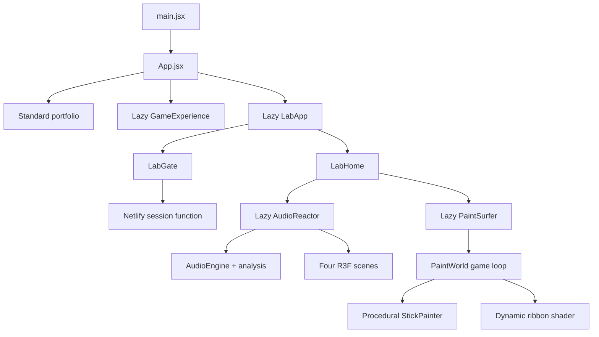

# Priitivi — Creative Developer Portfolio

An interactive portfolio that treats personal work as a set of playable interfaces. The public site combines an editorial landing page, a character-creation boss fight, and a protected experimental Lab containing real-time Web Audio and WebGL projects.

Live site: [priitivi.com](https://priitivi.com)

## What is here?

### Main portfolio

- Editorial hero, biography, project case files, CV download, and contact form.
- A responsive 2D presentation built for clarity before spectacle.
- An animated crashed UFO and navbar entry that lead to Priit's Lab.
- A lazy-loaded 3D fighter available directly from the hero and navigation.

### Portfolio Fighter

- Character creator with configurable appearance, clothing, and weapon.
- Comic-book story introduction and guided controls.
- Procedural 3D boss arena with attacks, dodging, health phases, and a caped boss.
- Portfolio information unlocked between combat phases.
- Keyboard and touch controls.

### Priit's Lab

The Lab is a protected route at `/lab`. Its experiments are loaded only after the Lab bundle is requested.

1. **Psychedelic Audio Reactor** — upload a local track and transform its waveform, frequency bands, stereo balance, and detected beats into four real-time visual systems.
2. **The Chroma Drifter** — control a stick artist carrying an oversized pencil through a blank 3D world. Running paints the floor; clicking or pressing `J` creates a metallic colour wave that becomes a temporary surfboard.

## Tech stack

| Layer | Technology | Purpose |
| --- | --- | --- |
| UI | React 19 | Components and application state |
| Build | Vite 6 | Development server, code splitting, and production builds |
| 3D | Three.js + React Three Fiber | Procedural characters, environments, shaders, particles, and game loops |
| Motion | Framer Motion | Landing-page transitions |
| Styling | Tailwind CSS + custom CSS | Utility styles and bespoke visual systems |
| Audio | Web Audio API | FFT analysis, waveform energy, beat detection, and local playback |
| Auth | Netlify Functions + Node crypto | Password verification and signed Lab sessions |
| Tests | Node test runner | Security, analysis, and gameplay helper tests |

## Architecture at a glance



The application intentionally uses a small route boundary instead of a full routing dependency. `App.jsx` delegates `/lab` paths to `LabApp`, and `LabApp` tracks its nested pathname with the History API. Each expensive interactive experience is imported with `React.lazy`, keeping it out of the initial portfolio bundle.

## Project structure

```text
Portfolio/
├─ netlify/
│  └─ functions/
│     ├─ lab-session.mjs          # Login, session validation, and logout
│     └─ _shared/lab-security.mjs # Scrypt hashing and signed-session helpers
├─ public/
│  └─ audio/                      # Chroma Drifter soundtrack assets
├─ scripts/
│  └─ hash-lab-password.mjs       # Hidden-input password hash helper
├─ src/
│  ├─ components/                 # Public portfolio sections and UFO portal
│  ├─ data/                       # Portfolio and fighter content
│  ├─ game/
│  │  ├─ GameExperience.jsx       # Fighter state machine and interface
│  │  ├─ ArenaScene.jsx           # Real-time combat scene
│  │  └─ game.css
│  ├─ lab/
│  │  ├─ auth/                    # Browser calls to the session endpoint
│  │  ├─ audio-reactor/
│  │  │  ├─ audio/                # FFT bands, amplitude, centroid, and beats
│  │  │  ├─ hooks/                # Analysis loop and adaptive quality
│  │  │  └─ scene/                # Neural, liquid, astral, and collapse modes
│  │  ├─ paint-surfer/
│  │  │  ├─ PaintSurfer.jsx       # Game shell, HUD, music, and controls
│  │  │  ├─ PaintWorld.jsx        # Movement, painting, camera, and shaders
│  │  │  ├─ StickPainter.jsx      # Procedural character and pencil
│  │  │  └─ paintMath.js          # Testable world/grid helpers
│  │  ├─ LabApp.jsx               # Protected Lab route boundary
│  │  └─ LabHome.jsx              # Experiment dashboard
│  ├─ App.jsx                     # Top-level experience switch
│  └─ index.css                   # Public portfolio visual system
├─ tests/                         # Node security, Function, audio, and game tests
└─ netlify.toml                   # Build, Function, and SPA redirect rules
```

## How the interesting systems work

### 1. Protected Lab sessions

The password never enters the client bundle. A Netlify Function receives the submitted password and compares it with a salted scrypt hash using a timing-safe comparison. A successful login returns a signed, short-lived cookie with these properties:

- `HttpOnly` — unavailable to browser JavaScript.
- `Secure` — sent only over HTTPS in production.
- `SameSite=Strict` — resists cross-site requests.
- 30-minute expiry.

The gate is access control for the route, not a secrecy boundary for compiled frontend code. Never put confidential data inside a static client bundle.

### 2. Audio Reactor pipeline

`AudioEngine` creates one media element and connects it to Web Audio analysers. Every animation frame produces a small mutable analysis object containing:

- RMS-style waveform amplitude.
- Sub-bass, bass, low-mid, mid, high-mid, and treble energy.
- Spectral centroid for perceived brightness.
- Stereo balance from split left/right channels.
- Beat impulses from a moving energy history and cooldown.

React does not rerender at audio frequency. The analyser writes into refs, and React Three Fiber scenes read those refs inside `useFrame`. This keeps high-frequency work out of the component render cycle.

### 3. Chroma Drifter game loop

`PaintWorld` owns mutable vectors for position, velocity, facing, jumping, and surf state. Keyboard and touch inputs live in a `Set`, so the render loop can read simultaneous controls without triggering React state updates.

Painting uses three layers:

1. An instanced field of coloured circles stamps the canvas with very few draw calls.
2. A fixed-size dynamic buffer geometry builds a two-sided trail from recent player positions.
3. A custom shader adds shifting colour and a silver gleam to that trail.

Only user-facing values—world saturation, surf chain, dialogs, and music state—use React state. The 60 FPS simulation stays in refs and Three.js objects.

### 4. Performance strategy

- Large experiences are route-level lazy chunks.
- Device heuristics lower particles, shadows, geometry, and pixel ratio on modest hardware.
- The Audio Reactor can reduce DPR dynamically when frame times remain slow.
- Instancing handles repeated paint marks, particles, and world structures.
- Mutable typed arrays avoid rebuilding trail geometry through React.
- Hidden tabs suspend the audio context and animation work where possible.
- Reduced-motion preferences lower camera and interface movement.

## Getting started

Requirements:

- Node.js 20 or newer.
- npm.
- Netlify CLI for the authenticated Lab workflow.

```bash
git clone https://github.com/Priitivi/Portfolio.git
cd Portfolio
npm ci
```

### Public portfolio preview

```bash
npm run dev
```

This is enough for the public portfolio and 3D fighter. It does not run the Lab authentication Function.

### Full local Lab preview

Generate a password hash:

```bash
npm run lab:hash-password
```

Create an uncommitted `.env` file:

```dotenv
LAB_PASSWORD_HASH=scrypt$your_generated_value
LAB_SESSION_SECRET=use-a-random-secret-at-least-32-characters-long
```

Then start the Netlify development runtime:

```bash
npx netlify dev
```

Open `http://localhost:8888/lab`.

Do not commit `.env`, place secrets in `netlify.toml`, or expose the plaintext password through a `VITE_` variable.

## Commands

| Command | Description |
| --- | --- |
| `npm run dev` | Start the Vite public-site preview |
| `npx netlify dev` | Start Vite with local redirects and Functions |
| `npm run build` | Create the production bundle in `dist/` |
| `npm run preview` | Preview the production bundle |
| `npm run lint` | Run ESLint across the repository |
| `npm test` | Run security, Function, audio, and gameplay tests |
| `npm run lab:hash-password` | Generate a salted Lab password hash |

## Testing

```bash
npm run lint
npm test
npm run build
```

The tests cover:

- Password hashing, timing-safe verification, session expiry, and tamper rejection.
- Login, signed-cookie restoration, invalid clearance, and logout Function behavior.
- Supported audio formats, frequency measurements, stereo balance, beat cooldowns, and transport formatting.
- Paint-cell quantisation, progress calculation, world bounds, and soundtrack asset presence.

Interactive changes should also be checked in a browser at desktop and mobile widths because WebGL capability, pointer input, autoplay policy, and GPU performance differ by device.

## Deployment

The project is configured for Netlify:

- Build command: `npm run build`
- Publish directory: `dist`
- Functions directory: `netlify/functions`
- SPA rewrites: `/lab` and `/lab/*`
- Function rewrite: `/lab/api/session`

Add `LAB_PASSWORD_HASH` and `LAB_SESSION_SECRET` through the Netlify environment-variable UI, then redeploy so Functions receive them.

## Audio and usage note

Files under `public/audio` are media supplied specifically for this portfolio and are not automatically covered by any source-code reuse permission. Confirm that you hold the necessary public-performance and redistribution rights before deploying or forking those tracks; otherwise replace them with properly licensed audio and update `soundtracks.js`.

This repository is available to study and learn from. Please credit Priitivi Ravi if reusing substantial visual or gameplay concepts, and check individual media rights separately.

## Contact

- Website: [priitivi.com](https://priitivi.com)
- GitHub: [@Priitivi](https://github.com/Priitivi)
- Email: [priitivi@gmail.com](mailto:priitivi@gmail.com)
