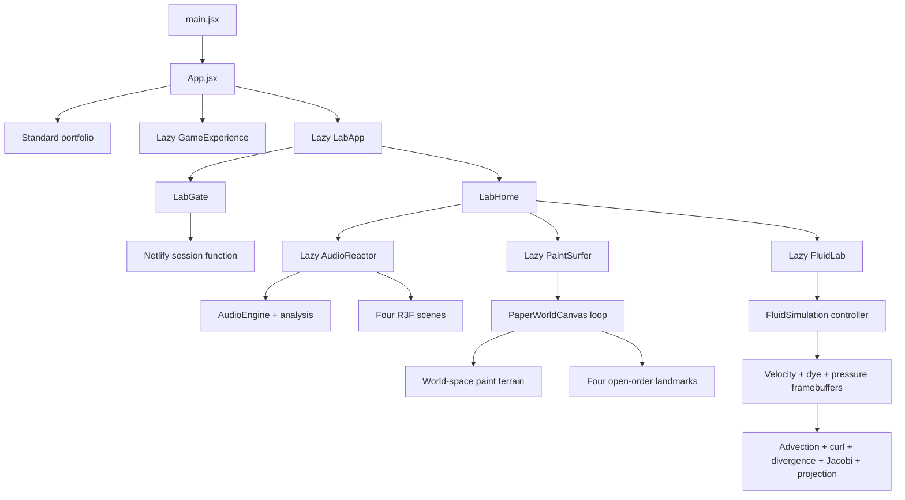

# Priitivi — Creative Developer Portfolio

An interactive portfolio that treats personal work as a set of playable interfaces. The public site combines an editorial landing page, a character-creation boss fight, and a protected experimental Lab containing real-time Web Audio and WebGL projects.

Live site: [priitivi.com](https://priitivi.com)

## What is here?

### Main portfolio

- Editorial hero, biography, project case files, CV download, and contact form.
- A responsive 2D presentation built for clarity before spectacle.
- An animated crashed UFO and navbar entry that lead to Priit's Lab.
- A lazy-loaded 3D fighter available directly from the hero and navigation.

### Portfolio Fighter

- Character creator with configurable appearance, clothing, and weapon.
- Comic-book story introduction and guided controls.
- Procedural 3D boss arena with attacks, dodging, health phases, and a caped boss.
- Portfolio information unlocked between combat phases.
- Keyboard and touch controls.

### Priit's Lab

The Lab is a protected route at `/lab`. Its experiments are loaded only after the Lab bundle is requested.

1. **Psychedelic Audio Reactor** — upload a local track and transform its waveform, frequency bands, stereo balance, and detected beats into four real-time visual systems.
2. **The Paper Drifter** — explore a 5,400-pixel 2D paper world where mouse or touch strokes become physical platforms. Draw routes, paint-dash across gaps, and restore four landmarks in any order while choosing from fourteen local tracks.
3. **Fluid Lab** — disturb a full-screen, pressure-solved GPU fluid field with mouse, pen, or touch. Pointer velocity injects momentum while six palettes, live solver controls, adaptive resolution, fullscreen, and keyboard shortcuts make the simulation feel like an instrument.

## Tech stack

| Layer | Technology | Purpose |
| --- | --- | --- |
| UI | React 19 | Components and application state |
| Build | Vite 6 | Development server, code splitting, and production builds |
| 3D | Three.js + React Three Fiber | Procedural characters, environments, shaders, particles, and game loops |
| 2D | Canvas 2D API | Paper-world rendering, drawing, particles, and platform physics |
| GPU simulation | WebGL2 + GLSL ES 3.0 | Multi-pass fluid advection, pressure projection, vorticity, dye, and display shading |
| Motion | Framer Motion | Landing-page transitions |
| Styling | Tailwind CSS + custom CSS | Utility styles and bespoke visual systems |
| Audio | Web Audio API | FFT analysis, waveform energy, beat detection, and local playback |
| Auth | Netlify Functions + Node crypto | Password verification and signed Lab sessions |
| Tests | Node test runner | Security, analysis, and gameplay helper tests |

## Architecture at a glance



The application intentionally uses a small route boundary instead of a full routing dependency. `App.jsx` delegates `/lab` paths to `LabApp`, and `LabApp` tracks its nested pathname with the History API. Each expensive interactive experience is imported with `React.lazy`, keeping it out of the initial portfolio bundle.

## Project structure

```text
Portfolio/
├─ netlify/
│  └─ functions/
│     ├─ lab-session.mjs          # Login, session validation, and logout
│     └─ _shared/lab-security.mjs # Scrypt hashing and signed-session helpers
├─ public/
│  └─ audio/                      # Paper Drifter soundtrack assets
├─ scripts/
│  └─ hash-lab-password.mjs       # Hidden-input password hash helper
├─ src/
│  ├─ components/                 # Public portfolio sections and UFO portal
│  ├─ data/                       # Portfolio and fighter content
│  ├─ game/
│  │  ├─ GameExperience.jsx       # Fighter state machine and interface
│  │  ├─ ArenaScene.jsx           # Real-time combat scene
│  │  └─ game.css
│  ├─ lab/
│  │  ├─ auth/                    # Browser calls to the session endpoint
│  │  ├─ audio-reactor/
│  │  │  ├─ audio/                # FFT bands, amplitude, centroid, and beats
│  │  │  ├─ hooks/                # Analysis loop and adaptive quality
│  │  │  └─ scene/                # Neural, liquid, astral, and collapse modes
│  │  ├─ paint-surfer/
│  │  │  ├─ PaintSurfer.jsx       # Game shell, HUD, music, and controls
│  │  │  ├─ PaperWorldCanvas.jsx  # 2D renderer, physics, paint, and camera
│  │  │  ├─ paperWorld.js         # Pure world, collision, and story helpers
│  │  │  └─ usePaintControls.js   # Persistent keyboard input state
│  │  ├─ fluid-lab/
│  │  │  ├─ FluidLab.jsx           # Chamber shell, input, shortcuts, fullscreen, and fallback UI
│  │  │  ├─ FluidControls.jsx      # Palettes, solver sliders, quality, and actions
│  │  │  ├─ FluidSimulation.js     # Raw WebGL2 pipeline, framebuffers, passes, and lifecycle
│  │  │  ├─ fluidConfig.js         # Palettes, presets, defaults, and pure helpers
│  │  │  ├─ shaders.js             # GLSL programs for every solver and display pass
│  │  │  └─ fluid-lab.css
│  │  ├─ LabApp.jsx               # Protected Lab route boundary
│  │  └─ LabHome.jsx              # Experiment dashboard
│  ├─ App.jsx                     # Top-level experience switch
│  └─ index.css                   # Public portfolio visual system
├─ tests/                         # Node security, Function, audio, and game tests
└─ netlify.toml                   # Build, Function, and SPA redirect rules
```

## How the interesting systems work

### 1. Protected Lab sessions

The password never enters the client bundle. A Netlify Function receives the submitted password and compares it with a salted scrypt hash using a timing-safe comparison. A successful login returns a signed, short-lived cookie with these properties:

- `HttpOnly` — unavailable to browser JavaScript.
- `Secure` — sent only over HTTPS in production.
- `SameSite=Strict` — resists cross-site requests.
- 30-minute expiry.

The gate is access control for the route, not a secrecy boundary for compiled frontend code. Never put confidential data inside a static client bundle.

### 2. Audio Reactor pipeline

`AudioEngine` creates one media element and connects it to Web Audio analysers. Every animation frame produces a small mutable analysis object containing:

- RMS-style waveform amplitude.
- Sub-bass, bass, low-mid, mid, high-mid, and treble energy.
- Spectral centroid for perceived brightness.
- Stereo balance from split left/right channels.
- Beat impulses from a moving energy history and cooldown.

React does not rerender at audio frequency. The analyser writes into refs, and React Three Fiber scenes read those refs inside `useFrame`. This keeps high-frequency work out of the component render cycle.

### 3. Paper Drifter game loop

`PaperWorldCanvas` is a Canvas 2D game loop with a fixed logical world and a smooth horizontal camera. Player position, velocity, coyote-time jumping, dash state, particles, paint strokes, and camera position live in refs. Keyboard and touch inputs live in a `Set`, so simultaneous controls never need frame-rate React rerenders.

Drawing is also level design:

1. Pointer coordinates are transformed from screen space into persistent world space.
2. Each stroke is stored as a capped polyline and rendered with ink, pigment, and highlight passes.
3. Descending player feet sample nearby line segments, turning suitable strokes into walkable platforms and ramps.
4. Paint cells near a landmark restore its colour without forcing a fixed completion order.

Only user-facing values—total restoration, landmark status, dash count, dialogs, and music state—use React state. The animation loop remains mutable and allocation-conscious. The soundtrack UI exposes all fourteen supplied tracks while the browser loads only the selected source.

### 4. Fluid Lab solver

`FluidSimulation` owns a raw WebGL2 pipeline so the numerical work stays on the GPU and React only handles human-scale UI state. Every animation frame runs this sequence:

1. Pointer samples add dye to the colour field and velocity to the momentum field through GPU splat passes.
2. Curl is measured from velocity and vorticity confinement restores small rotating structures.
3. Divergence measures where the provisional velocity field is compressing or expanding.
4. A ping-pong Jacobi solve iterates the pressure field between two floating-point framebuffers.
5. The pressure gradient is subtracted from velocity, projecting it toward an incompressible field.
6. Velocity and dye are each advected through the corrected flow with configurable dissipation.
7. A final display shader tone-maps the dye, adds subtle surface lighting, vignette, and dithering, then draws to the screen.

Velocity, dye, and pressure each use paired floating-point render targets; divergence and curl use dedicated single targets. The controller reallocates them from aspect-aware quality presets, caps display DPR, suspends updates in hidden tabs, and deletes every texture, framebuffer, program, vertex array, observer, listener, and animation frame when the route unmounts. WebGL2 and `EXT_color_buffer_float` are checked before the chamber opens; unsupported devices receive a readable fallback rather than a broken canvas.

React deliberately does not receive per-frame simulation data. Pointer records and the solver live in refs, while the only recurring UI update is one small performance sample per second. This prevents the fluid loop from becoming a React render loop.

### 5. Performance strategy

- Large experiences are route-level lazy chunks.
- Device heuristics lower particles, shadows, geometry, and pixel ratio on modest hardware.
- The Audio Reactor can reduce DPR dynamically when frame times remain slow.
- Paper-world rendering caps device pixel ratio, stroke count, points per stroke, and particles.
- Physics examines only recent paint strokes instead of every historical mark.
- Hidden tabs suspend the audio context and animation work where possible.
- Reduced-motion preferences lower camera and interface movement.
- Fluid buffers scale independently from display pixels, manual bilinear advection works without float-linear filtering, and Auto quality steps down after sustained slow frames.
- Fluid Lab is a lazy route chunk and adds no shader compilation or framebuffers to the main portfolio, fighter, Audio Reactor, or Paper Drifter.

## Getting started

Requirements:

- Node.js 20 or newer.
- npm.
- Netlify CLI for the authenticated Lab workflow.

```bash
git clone https://github.com/Priitivi/Portfolio.git
cd Portfolio
npm ci
```

### Public portfolio preview

```bash
npm run dev
```

This is enough for the public portfolio and 3D fighter. It does not run the Lab authentication Function.

### Full local Lab preview

Generate a password hash:

```bash
npm run lab:hash-password
```

Create an uncommitted `.env` file:

```dotenv
LAB_PASSWORD_HASH=scrypt$your_generated_value
LAB_SESSION_SECRET=use-a-random-secret-at-least-32-characters-long
```

Then start the Netlify development runtime:

```bash
npx netlify dev
```

Open `http://localhost:8888/lab`.

Do not commit `.env`, place secrets in `netlify.toml`, or expose the plaintext password through a `VITE_` variable.

## Commands

| Command | Description |
| --- | --- |
| `npm run dev` | Start the Vite public-site preview |
| `npx netlify dev` | Start Vite with local redirects and Functions |
| `npm run build` | Create the production bundle in `dist/` |
| `npm run preview` | Preview the production bundle |
| `npm run lint` | Run ESLint across the repository |
| `npm test` | Run security, Function, audio, and gameplay tests |
| `npm run lab:hash-password` | Generate a salted Lab password hash |

## Testing

```bash
npm run lint
npm test
npm run build
```

The tests cover:

- Password hashing, timing-safe verification, session expiry, and tamper rejection.
- Login, signed-cookie restoration, invalid clearance, and logout Function behavior.
- Supported audio formats, frequency measurements, stereo balance, beat cooldowns, and transport formatting.
- 2D movement actions, screen-to-world drawing transforms, paint-platform sampling, open-order story progression, and all soundtrack assets.
- Fluid palettes, automatic quality heuristics, aspect-aware framebuffer sizing, WebGL pointer mapping, reduced-motion defaults, and the presence of every required solver stage.

Interactive changes should also be checked in a browser at desktop and mobile widths because WebGL capability, Canvas pointer input, autoplay policy, and graphics performance differ by device.

## Deployment

The project is configured for Netlify:

- Build command: `npm run build`
- Publish directory: `dist`
- Functions directory: `netlify/functions`
- SPA rewrites: `/lab` and `/lab/*`
- Function rewrite: `/lab/api/session`

Add `LAB_PASSWORD_HASH` and `LAB_SESSION_SECRET` through the Netlify environment-variable UI, then redeploy so Functions receive them.

## Audio and usage note

Files under `public/audio` are media supplied specifically for this portfolio and are not automatically covered by any source-code reuse permission. Confirm that you hold the necessary public-performance and redistribution rights before deploying or forking those tracks; otherwise replace them with properly licensed audio and update `soundtracks.js`.

This repository is available to study and learn from. Please credit Priitivi Ravi if reusing substantial visual or gameplay concepts, and check individual media rights separately.

## Contact

- Website: [priitivi.com](https://priitivi.com)
- GitHub: [@Priitivi](https://github.com/Priitivi)
- Email: [priitivi@gmail.com](mailto:priitivi@gmail.com)
