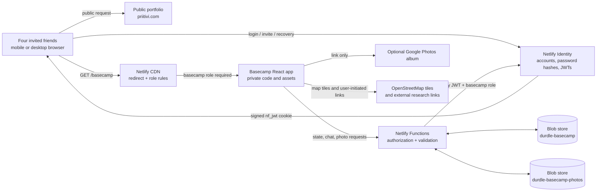
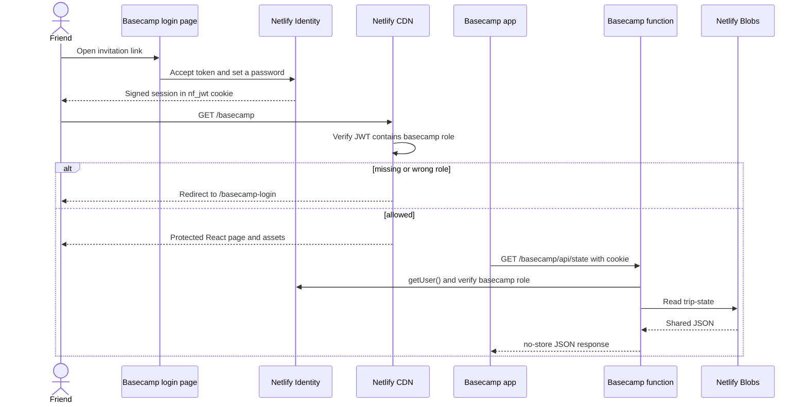
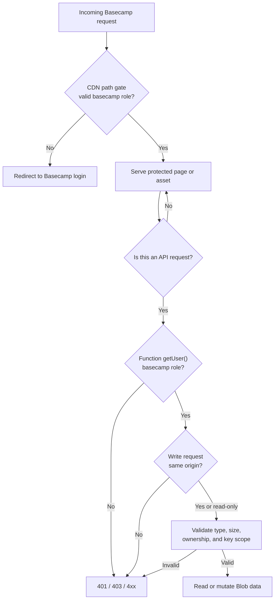
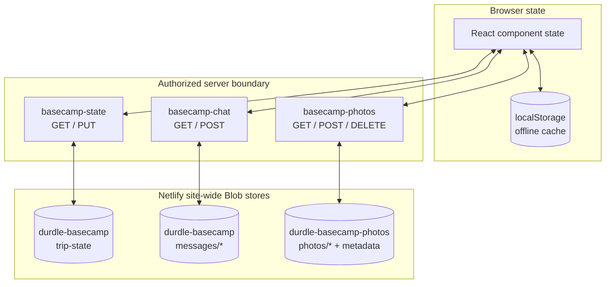
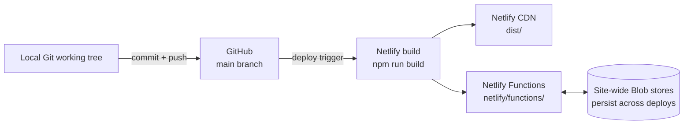

# Durdle Basecamp: architecture, security, and operating guide

Last reviewed: 25 July 2026

This document explains how the private Durdle Basecamp planner works, where its data and images are stored, what security guarantees it does and does not provide, and how to operate it safely.

## 1. Executive summary

Durdle Basecamp is a private collaborative section inside Priitivi's public portfolio. The public portfolio and Basecamp share one React deployment, but the Basecamp route, its code bundle, its research images, and its server APIs are protected separately.

The production system uses:

- React and Vite for the browser interface.
- Netlify's CDN for hosting and role-gated routing.
- Netlify Identity for invite-only email/password accounts.
- A `basecamp` role in each allowed account's signed JWT.
- Netlify Functions for all shared data access.
- Netlify Blobs for shared plans, chat messages, and uploaded photos.
- Browser `localStorage` as an offline cache, not as the production source of truth.

The practical trust statement is:

> Only invited Identity accounts with the `basecamp` role can request the Basecamp page, its private assets, or its APIs. Every API checks that role again before reading or writing shared data. Passwords are handled by Netlify Identity rather than by the portfolio application. Uploaded photos are encrypted by Netlify at rest and in transit, but Priitivi, as the Netlify project owner, can administer and download the site's stored blobs.

This is appropriate for a four-person holiday planner. It is not end-to-end encrypted, anonymous, or designed to protect data from the Netlify account owner.

## 2. System context



### Boundary decisions

- The portfolio remains public.
- `/basecamp-login` remains public because invited users need somewhere to sign in or accept an invitation.
- `/basecamp`, `/basecamp/*`, `/basecamp-assets/*`, `/campsites/*`, and `/fishing/*` require the `basecamp` role.
- `/basecamp/api/*` routes reach functions, but those functions independently require the same role.
- The invitation artwork at `/basecamp-og.png` is intentionally public because the login page needs it. It contains no private itinerary or user-uploaded content.

## 3. Request and authentication flow



### Account lifecycle

1. Priitivi sends a Netlify Identity invitation to one exact email address.
2. The recipient follows the signed, time-limited invitation link and creates their own password.
3. The account must have the `basecamp` role.
4. A successful login produces a signed JWT stored in an `nf_jwt` cookie.
5. Netlify's edge uses the role in that JWT for protected route decisions.
6. Functions call `getUser()` and check the role again for server-side authorization.
7. Removing the role or deleting the Identity user removes future access.

Netlify notes that changing a role does not invalidate an already-issued JWT immediately. The new role is applied when the token refreshes, normally on the next login or an explicit session refresh. For urgent removal, remove the user or role and ask the person to sign out; treat the current token lifetime as the maximum revocation delay.

### Password handling

The Basecamp application does not have a password database and does not save passwords in React state after the page is closed, in Netlify Blobs, in Git, or in application logs.

The password fields are sent directly from the browser to the site's same-origin Netlify Identity endpoint, `/.netlify/identity`. Netlify Identity verifies the account and returns a session. The current open-source GoTrue implementation used by Netlify Identity:

- stores `EncryptedPassword` separately and omits it from ordinary user JSON;
- hashes new passwords with bcrypt;
- verifies passwords with bcrypt comparison rather than decrypting them.

Bcrypt hashes are deliberately one-way. Priitivi cannot view a friend's plaintext password, and neither can the Basecamp code. The supported recovery path is to send a password-reset email and let the account owner choose a new password.

## 4. Authorization layers



### Access matrix

| Resource | Anonymous visitor | Signed in, no `basecamp` role | `basecamp` crew member | Netlify project owner |
|---|---:|---:|---:|---:|
| Public portfolio | Read | Read | Read | Administer deployment |
| Basecamp login/invite page | Read | Read | Read | Administer |
| Basecamp page and protected bundles | Redirected | Redirected | Read | Administer |
| Campsite/fishing research images | Redirected | Redirected | Read | Administer source/deploy |
| Shared trip state | Denied by function | Denied by function | Read/write | Browse/download Blob data |
| Chat | Denied by function | Denied by function | Read/write | Browse/download Blob data |
| Uploaded photos | Denied by function | Denied by function | Read; uploader can delete own | Browse/download/delete Blob data |
| Password plaintext | Never available | Never available | Only knows own password | Cannot view plaintext |

### Per-person Kit authorization

Kit items have two completion modes:

- `shared`: one normal checkbox represents a group-level decision or action.
- `individual`: four personal acknowledgements are shown; only the signed-in person's checkbox is enabled.

This rule is enforced twice:

1. The React interface disables the other three checkboxes.
2. The state function compares the requested update with the stored item and only permits the authenticated crew member's acknowledgement to change. A crafted API request cannot add or remove another person's acknowledgement.

The server derives identity from the authenticated email/user ID; it does not accept a caller-supplied “active user” value.

Before inviting Oliver, add his exact email mapping in both:

- `src/components/Basecamp.jsx`
- `netlify/functions/_shared/basecamp-api.mjs`

Without that mapping, Oliver can still authenticate if invited and assigned the role, but the fixed four-person Kit display will not know which personal checkbox is his.

## 5. Data architecture



### Shared trip state

- Store: `durdle-basecamp`
- Key: `trip-state`
- Consistency: strong

Maximum encoded request: 250 KB

The state is one JSON document:

```text
TripState
├── albumUrl
├── campsites[]
│   ├── research facts and source links
│   ├── votes[]
│   └── notes[]
├── itinerary[]
│   ├── day
│   ├── time
│   ├── title and detail
│   └── status
├── packing[]
│   ├── category and owner
│   ├── completionMode: shared | individual
│   ├── done: boolean
│   └── acknowledgements: crewId[]
└── expenses[]
```

Itinerary position is represented by array order. Moving an activity swaps it with the adjacent activity on the same day and then saves the updated array.

Kit completion is backward-compatible with older saved state:

- Existing shared `done` values remain valid.
- Existing default items are merged with the new schema.
- New custom items default to one shared tick unless “Everyone ticks their own” is selected.
- The server protects each person's acknowledgement during every write.

### Sync behavior

- On opening Basecamp, the browser reads the server copy.
- The app polls trip state every 15 seconds.
- Edits are debounced for 700 milliseconds and then write the whole trip document.
- The browser saves the current trip to `localStorage` as an offline copy.
- If the server cannot be reached, the interface reports “Offline copy”.

The shared state currently uses last-writer-wins replacement. Two people editing different ordinary fields at almost the same time can overwrite one another if both started from stale copies. Personal Kit acknowledgements are protected server-side from this class of overwrite, but itinerary, votes, notes, and expenses are still whole-document fields.

For a four-person, low-frequency planner this is a reasonable MVP trade-off. If collaboration becomes busier, move each campsite note, vote, itinerary item, Kit item, and expense into its own key or database row with revision/ETag checks.

### Chat

- Store: `durdle-basecamp`
- Key pattern: `messages/{timestamp}-{UUID}`
- Message limit: 500 characters
- Read window: latest 100 messages

Polling: every 10 seconds

The function derives the author name from the authenticated user. The browser cannot submit a different author. Each message is an append-only blob, so simultaneous messages do not overwrite one another.

There is no message-delete feature, expiry policy, or end-to-end encryption. Older messages beyond the displayed 100 remain stored unless they are removed through an administrative process.

### Uploaded photos

- Store: `durdle-basecamp-photos`
- Key pattern: `photos/{timestamp}-{UUID}`
- Accepted server types: JPEG, PNG, WebP
- Maximum server image size: 2 MB

Displayed window: latest 60 photos

The browser:

- accepts an image;
- preserves an already-compatible image up to 1.6 MB;
- otherwise scales the longest side down to at most 1600 pixels;
- converts the result to JPEG at quality 0.82;
- uploads the file and an optional caption.

The server stores the image bytes plus:

- caption;
- uploader name derived from Identity;
- upload timestamp;
- MIME type.

The gallery receives an authenticated function URL, not a public Blob URL. A photo read checks the `basecamp` role before returning bytes. A normal crew member can delete only a photo whose server-recorded uploader name matches their authenticated name.

Netlify states that Blob data is encrypted at rest and in transit and can only be accessed through the owning site. Netlify also makes the blobs browsable and downloadable to the Netlify project owner in its UI. Therefore:

- random internet visitors cannot enumerate or download Basecamp uploads through the application;
- invited crew can view the uploads;
- Priitivi, as project owner, can administer and download them;
- Netlify is a trusted infrastructure provider;
- this is not end-to-end encryption.

The code checks file size and declared MIME type, but it does not currently perform malware scanning or server-side image decoding. The random UUID key prevents predictable guessing, and the function requires authorization even when a key is known.

### Research and design images

The campsite and fishing-company images are static build assets under:

- `public/campsites/`
- `public/fishing/`

The generated Basecamp code bundle is placed under `basecamp-assets/`. All three paths are role-gated in `public/_redirects`.

These research images are not treated as secrets. They come from public tourism, campsite, or operator sources and should retain their source link/credit. If the Git repository is public, every committed static asset can also be recovered from Git history even though the production CDN route is gated. Never commit private trip photos, home addresses, booking references, or personal documents into `public/`.

The invitation hero image `/basecamp-og.png` is deliberately public and must not contain sensitive information.

### Google Photos

Basecamp currently stores only the Google Photos album URL in `trip-state`. It does not copy, index, or proxy the Google Photos images.

Access to the actual album is controlled by Google Photos and the album's sharing settings. A “shared link” may be accessible to anyone who receives or forwards that link. Use Google account-restricted sharing if the group needs stronger control, and remove the Basecamp link after the trip if desired.

## 6. Browser security controls

The protected routes receive scoped headers from `public/_headers`:

- `Content-Security-Policy` restricts scripts, connections, forms, images, framing, and plugins to the resources Basecamp requires.
- `frame-ancestors 'none'` and `X-Frame-Options: DENY` prevent other sites from embedding Basecamp.
- `X-Content-Type-Options: nosniff` prevents MIME sniffing.
- `Referrer-Policy: strict-origin-when-cross-origin` limits information sent to external research links.
- `Permissions-Policy` disables camera, microphone, and geolocation for Basecamp.

API JSON responses use:

- `Cache-Control: no-store`;
- a deny-all CSP;
- `X-Content-Type-Options: nosniff`.

Photo responses use private, short-lived caching and `nosniff`.

Additional application controls include:

- same-origin checks on state, chat, upload, and delete mutations;
- maximum state, message, caption, and image sizes;
- allow-listed image MIME types;
- scoped photo key prefixes and rejection of `..`;
- safe external-link protocol validation for the Google Photos URL;
- React's default text escaping for rendered user content;
- server-derived chat and photo author names;
- owner-only photo deletion;
- author-only campsite-comment deletion in the interface;
- server-enforced personal Kit acknowledgements.

## 7. What friends can trust—and what they should know

### Reasonable assurances

- There is no open self-registration flow.
- An exact invited email must accept an invitation.
- Authentication is handled by Netlify Identity.
- Plaintext passwords are not visible to Priitivi or stored in this repository.
- Protected pages and research assets are blocked at the CDN before delivery.
- Shared APIs repeat authorization checks on the server.
- Uploaded trip photos are not public static files.
- Netlify encrypts Blob data at rest and in transit.
- The app does not contain advertising trackers or analytics code for Basecamp.

### Honest limitations

- Priitivi controls the Netlify project and can browse/download stored Blob data.
- Netlify is trusted as the hosting, identity, and storage provider.
- The system is not end-to-end encrypted.
- Anyone with an unlocked signed-in phone can act as that user until sign-out/session expiry.
- Role removal may not affect a JWT until it refreshes.
- `localStorage` contains an offline copy of shared trip state on every device that opens Basecamp. Browser storage is not encrypted by the app. Signing out does not currently erase that cache.
- Google Photos link privacy depends on Google album settings and whether somebody forwards the link.
- Static files committed to Git are not confidential, particularly if the repository is public.
- The trip-state document is last-writer-wins, so simultaneous ordinary edits can conflict.
- Photos are size/type checked but not malware-scanned.
- The current photo and chat views limit how many records are shown; they do not automatically delete older records.

Avoid putting passport details, payment card data, exact live locations, door codes, private medical information, or booking credentials into Basecamp.

## 8. Deployment architecture



The Vite build output is `dist`. Functions deploy from `netlify/functions`. Blob stores are site-wide rather than tied to one deploy, so a new version of the site reads the existing shared trip, chat, and photos.

Production changes should follow:

1. Make backward-compatible schema changes.
2. Run `npm run lint`.
3. Run `npm test`.
4. Run `npm run build`.
5. Review the diff for accidental secrets or unrelated files.
6. Commit the intended files.
7. Push the tested commit to `main`.
8. Wait for Netlify to finish deploying.
9. Verify anonymous `/basecamp` access redirects to login.
10. Verify anonymous API calls return `401` or `403`.
11. Sign in and smoke-test the changed feature on a phone.

## 9. Operational playbook

### Invite a friend

1. Confirm their exact email address.
2. Add/update the fixed crew email mapping in the client and server.
3. Deploy that mapping before inviting them.
4. Invite the address in Netlify Identity.
5. Assign the `basecamp` role.
6. Ask them to open only the invitation sent by Netlify and choose a unique password.
7. Confirm they can see only their own enabled Kit acknowledgements.

### Remove access

1. Remove the `basecamp` role or delete the Identity user in Netlify.
2. Ask the person to sign out on all devices.
3. For urgent incidents, rotate any shared external links and inspect stored data.
4. Remember that an already-issued JWT may remain effective until refresh/expiry.

### Lost or shared phone

1. Reset the Identity password.
2. Remove/re-add the role if access must be suspended.
3. Clear site data for `priitivi.com` on that device when possible.
4. Rotate the Google Photos link if it may have been exposed.

### Backups

Netlify's UI lets the project owner browse and download individual blobs. Before a major schema migration:

1. Download `durdle-basecamp/trip-state`.
2. Export any photos that matter.
3. Record the deployment commit.
4. Test migration code against a copy.

The application does not yet provide a one-click export or restore workflow.

## 10. Design choices in this release

### Two Kit completion modes

One checkbox is correct for decisions such as “booking confirmation received”. Four acknowledgements are correct when every person must independently pack or check something. Storing the mode on each item avoids forcing one behavior across the whole category.

Only the current person's box is interactive. Disabled boxes still show group progress, so the interface remains collaborative without permitting one person to impersonate another. The server repeats that ownership rule.

### Vote chart on Basecamp

The campsite summary uses a 0–4 horizontal bar scale because the denominator is fixed at four crew members. It communicates relative support faster than a ranked list while preserving a direct link to the full campsite comparison.

### Itinerary ordering

Up/down controls were chosen over drag-and-drop because they:

- work reliably with touch, keyboard, and assistive technology;
- do not conflict with vertical page scrolling;
- make small, deliberate changes;
- need no extra dependency;
- preserve the existing array-based data model.

## 11. Recommended next features

### Highest value before the trip

1. **Weather, tide, and sea-state board**
   Add a read-only forecast panel for Weymouth/Lulworth, tide times, wind, rain, and a clear “charter risk” signal. Cache API data server-side and show its source/update time.

2. **Decision deadline and ranked-choice campsite voting**
   Let each person rank their top three and set a booking deadline. This is more decisive than independent approval votes when several sites tie.

3. **Emergency/offline card**
   A compact page containing campsite address, booking contact, charter contact, car registration, nearest urgent-care information, and emergency meeting point. Make it explicitly downloadable for offline use; keep sensitive fields minimal.

4. **Packing templates and quantities**
   Add “personal”, “one for the group”, and quantity-based templates. For example: four sleeping bags, two tents, one stove, one booking confirmation.

5. **Booking decision panel**
   Track campsite and charter status as `researching → contacted → held → paid`, including cancellation deadline and who contacted the operator.

### Collaboration and reliability

6. **Activity history**
   Record who changed a campsite vote, itinerary item, Kit state, or expense and when. This improves trust and makes accidental edits reversible.

7. **Conflict-resistant storage**
   Store items individually and use Blob ETags/conditional writes, or move to a relational database. This eliminates whole-document last-writer-wins conflicts.

8. **Notifications**
   Send opt-in email or messaging reminders for booking deadlines, unpaid expenses, and personal Kit gaps. Never send without each person's consent.

9. **One-click export**
   Download the plan, expenses, messages, and image manifest as JSON/PDF before departure and before deleting post-trip data.

10. **Post-trip archive mode**
    Lock planning fields, preserve the final itinerary and spend summary, link the finished Google Photos album, then schedule deletion of chat and temporary uploads.

### Photo improvements

11. **Thumbnail generation**
    Store a small gallery thumbnail and load the full photo only when opened. This improves phone performance and data usage.

12. **Server-side image verification and metadata policy**
    Decode and re-encode every upload server-side, strip EXIF metadata consistently, and optionally scan files. Browser canvas conversion often strips metadata, but already-small compatible files currently bypass re-encoding.

13. **Google Photos integration**
    Keep the current link-only design unless the group wants OAuth complexity. A real importer would require Google authorization, token storage, consent, revocation handling, and a clear explanation of what the site can access.

### Expense improvements

14. **Per-expense split rules**
    Support equal split, selected people, or custom shares, then generate a settlement summary. Keep actual payment in Monzo/Revolut rather than storing banking credentials.

15. **Receipt attachment**
    Allow an image against an expense, reusing the protected photo pipeline. Add retention/deletion controls because receipts can contain personal information.

## 12. Security improvement backlog

Recommended order:

1. Clear the Basecamp `localStorage` cache during sign-out.
2. Add per-record revision or ETag conflict protection.
3. Add an owner-facing data export and retention/delete tool.
4. Enforce a total photo count/storage quota instead of only limiting the displayed list.
5. Add server-side image decode/re-encode and EXIF stripping.
6. Add structured, privacy-conscious security logging.
7. Enable Netlify Identity audit logs if the selected plan supports them.
8. Add automated production checks for protected routes and APIs after every deploy.
9. Review source-repository visibility and keep all private data out of Git history.

## 13. Relevant implementation files

| Concern | File |
|---|---|
| React route selection | `src/App.jsx` |
| Basecamp UI, state migration, and sync | `src/components/Basecamp.jsx` |
| Basecamp responsive styles | `src/components/Basecamp.css` |
| Invite/login/recovery interface | `src/components/BasecampAccess.jsx` |
| Map data and rendering | `src/components/TripMap.jsx` |
| CDN role gates | `public/_redirects` |
| Scoped browser security headers | `public/_headers` |
| Shared authentication helpers | `netlify/functions/_shared/basecamp-api.mjs` |
| Trip state function | `netlify/functions/basecamp-state.mjs` |
| Chat function | `netlify/functions/basecamp-chat.mjs` |
| Photo function | `netlify/functions/basecamp-photos.mjs` |
| Netlify build settings | `netlify.toml` |
| Vite protected chunk naming | `vite.config.js` |
| Server acknowledgement tests | `tests/basecamp-state.test.mjs` |

## 14. Sources

- [Netlify Identity overview](https://docs.netlify.com/manage/security/secure-access-to-sites/identity/overview/)
- [Netlify Identity registration and login](https://docs.netlify.com/security/secure-access-to-sites/identity/registration-login/)
- [Netlify role-based access control and JWT behavior](https://docs.netlify.com/manage/security/secure-access-to-sites/role-based-access-control/)
- [Netlify role-based redirect options](https://docs.netlify.com/manage/routing/redirects/redirect-options/)
- [Netlify Blobs storage, UI access, and sensitive-data guidance](https://docs.netlify.com/build/data-and-storage/netlify-blobs/)
- [Netlify security checklist](https://docs.netlify.com/resources/checklists/security-checklist/)
- [Open-source Netlify GoTrue user/password model](https://github.com/netlify/gotrue/blob/master/models/user.go)

## 15. Final assessment

For four known friends planning one weekend, this architecture is appropriately small, understandable, and defensible. It avoids a custom password database, protects both content delivery and data APIs, stores uploads outside the public build, and now enforces personal Kit acknowledgements on the server.

The most important security message to the crew is simple: Basecamp is private to invited accounts, but it is a hosted shared workspace—not a secret vault. Use unique passwords, keep phones locked, do not paste highly sensitive information into it, and remember that the project owner and hosting provider administer the stored data.
