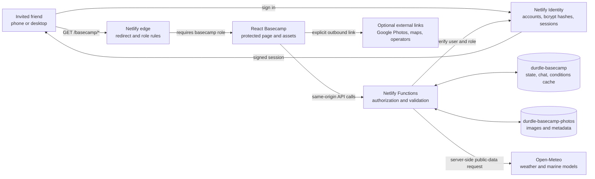
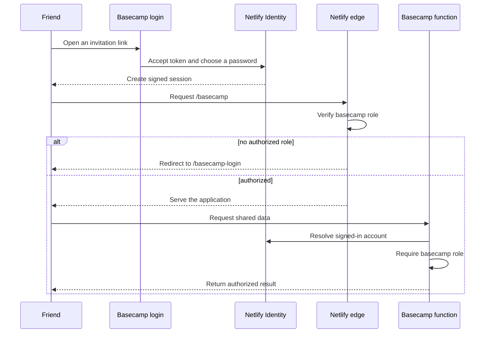
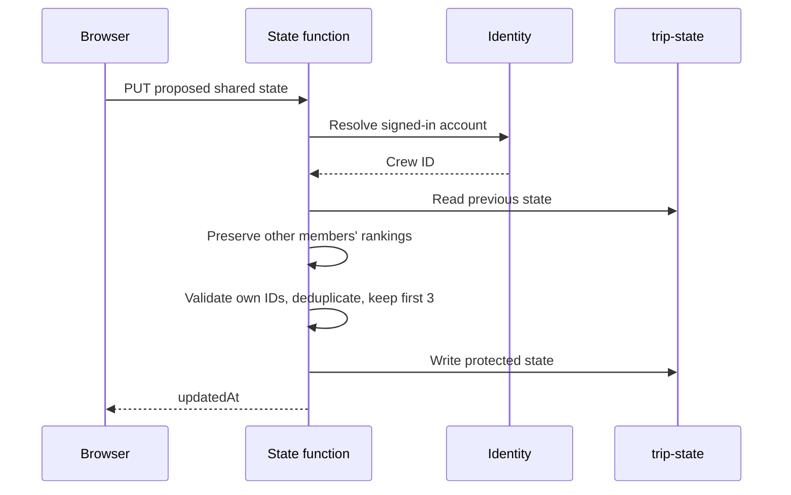
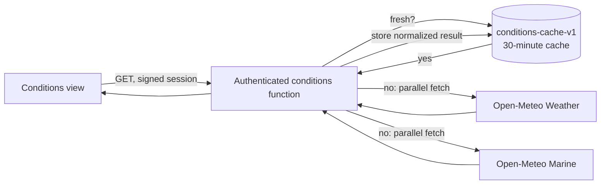
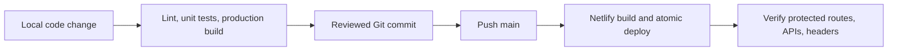

# Durdle Basecamp: architecture and security guide

Version: 25 July 2026

Trip: 21–23 August 2026
Audience: the Basecamp crew, future maintainers, and anyone reviewing the security model

## 1. What Basecamp is

Durdle Basecamp is a private, collaborative trip room inside Priitivi's public
portfolio. Four friends use it to compare campsites, rank their top three,
choose a booking deadline, plan an itinerary, coordinate Kit, record expenses,
chat, store trip photos, and check coastal conditions.

The production system uses:

- React and Vite for the browser interface.
- Netlify's CDN for hosting and role-gated routing.
- Netlify Identity for invite-only email/password accounts.
- A `basecamp` role in each allowed account's signed session.
- Netlify Functions for every shared-data operation.
- Netlify Blobs for trip state, chat, uploaded photos, and the conditions cache.
- Open-Meteo weather and marine models for the Conditions board.
- Browser `localStorage` as an offline cache, not the production source of truth.

The practical trust statement is:

> Only an invited Identity account with the `basecamp` role can request the
> Basecamp page, its private assets, or its APIs. Every API checks that role
> again. Passwords are handled by Netlify Identity rather than this
> application. Uploaded photos are private to authorized accounts and
> encrypted by the platform in transit and at rest, but the Netlify project
> owner can administer the site's stored data.

This model is appropriate for a small friends-only holiday planner. It is not
end-to-end encrypted, anonymous, or designed to protect data from the Netlify
project owner.

The readable in-app version is available to signed-in crew at
`/basecamp/docs`. The repository version you are reading is more detailed.

## 2. System context



There are two authorization gates:

1. Netlify's edge checks the role before serving `/basecamp`, descendants such
   as `/basecamp/docs`, and private research images.
2. Each function independently resolves the signed-in user and requires the
   same `basecamp` role.

The second check matters. A user cannot bypass the interface and call a data
endpoint directly without passing server-side authorization.

## 3. Request and route map

| Browser route | Purpose | Access |
|---|---|---|
| `/` | Public portfolio | Public |
| `/basecamp-login` | Invitation, login, recovery, and logout UI | Public |
| `/basecamp` | Trip planner | `basecamp` role |
| `/basecamp/docs` | Readable architecture and security guide | `basecamp` role |
| `/basecamp-assets/*` | Basecamp art and private static media | `basecamp` role |
| `/campsites/*` | Researched campsite images | `basecamp` role |
| `/fishing/*` | Researched operator images | `basecamp` role |

| API route | Function | Methods |
|---|---|---|
| `/basecamp/api/state` | `basecamp-state.mjs` | `GET`, `PUT` |
| `/basecamp/api/chat` | `basecamp-chat.mjs` | `GET`, `POST` |
| `/basecamp/api/photos` | `basecamp-photos.mjs` | `GET`, `POST`, `DELETE` |
| `/basecamp/api/conditions` | `basecamp-conditions.mjs` | `GET` |

`public/_redirects` owns the production route rules. API rewrites appear before
the broad `/basecamp/*` rule so a function request cannot accidentally fall
through to the React document.

`src/App.jsx` treats both `/basecamp` and `/basecamp/*` as Basecamp routes.
`Basecamp.jsx` selects the documentation view when the path ends in `/docs`.

## 4. Authentication lifecycle



### Account lifecycle

1. Priitivi sends a Netlify Identity invitation to one exact email address.
2. The recipient follows the signed invitation link.
3. The recipient creates their own password.
4. The account is assigned the `basecamp` role.
5. A successful login creates a signed session.
6. Netlify's edge and every Basecamp function check that role.
7. Access can later be removed by removing the user or the role.

There is no public self-registration flow. A friend who has not been invited
does not have an account and cannot open Basecamp.

### Password handling

Basecamp does not maintain a password table. Passwords are not stored in:

- React state after the Identity transaction completes;
- Netlify Blobs;
- Git;
- the trip JSON;
- chat or photo metadata;
- the conditions cache.

The browser sends credentials to the site's Netlify Identity endpoint. The
underlying GoTrue service stores a one-way bcrypt password hash and verifies a
login by comparing hashes. A bcrypt hash cannot be decrypted back into the
original password.

Consequences:

- Priitivi cannot view a friend's plaintext password.
- The Basecamp application cannot view it.
- Netlify's ordinary user data does not expose it.
- A forgotten password is reset; it is not retrieved.
- Each friend should use a unique password and protect access to their email.

## 5. Authorization and identity mapping

The shared helper is
`netlify/functions/_shared/basecamp-api.mjs`.

`requireBasecampUser()`:

1. asks Netlify Identity for the current user;
2. returns `401 UNAUTHENTICATED` if there is no user;
3. returns `403 FORBIDDEN` if the role is missing;
4. returns the user to the function only after both checks pass.

Known crew emails map to stable IDs. Other authorized `basecamp` accounts use a
stable Identity-derived ID, and the server stores their trusted display name in
`campsiteVoters` so their ranking is visible in crew totals. This mapping
supports actions that belong to one person, such as individual Kit
acknowledgements and campsite rankings. The interface never offers a "post as
someone else" selector.

| Capability | Anonymous visitor | Signed in without role | Basecamp crew | Project owner |
|---|---:|---:|---:|---:|
| Open the private page | No | No | Yes | Administer |
| Read shared trip state | No | No | Yes | Administer |
| Edit common trip fields | No | No | Yes | Administer |
| Change another person's ranking | No | No | No | Administer storage/code |
| Change another person's individual Kit tick | No | No | No | Administer storage/code |
| Read chat | No | No | Yes | Administer |
| Read uploaded photos | No | No | Yes | Administer |
| Delete another friend's photo through the app | No | No | No | Administer storage |
| View a plaintext password | No | No | Only their own knowledge | No |

The final row is important: administrative control of the Netlify project does
not turn a bcrypt hash into a plaintext password.

## 6. Shared data model

The main trip document is stored under:

- store: `durdle-basecamp`
- key: `trip-state`

An abbreviated shape is:

```json
{
  "state": {
    "campsites": [],
    "campsiteRankings": {
      "priitivi": ["shortlake-farm", "eweleaze", "ringstead"]
    },
    "campsiteVoters": {
      "priitivi": { "name": "Priitivi" }
    },
    "campsiteDecision": {
      "deadline": "2026-08-02"
    },
    "itinerary": [],
    "packing": [],
    "expenses": [],
    "albumUrl": ""
  },
  "updatedAt": "2026-07-25T12:00:00.000Z"
}
```

The client merges stored data with the current built-in campsite and Kit
defaults. This lets a newer deployment add researched entries without erasing
crew comments, rankings, or completion state.

Rank changes use a dedicated authenticated `PATCH /basecamp/api/state` request.
The client applies the choice optimistically, locks all vote controls until the
request completes, then either adopts the returned server state or restores the
previous ranking with an inline error. The general `PUT` path still saves the
rest of the shared trip document.

### Storage inventory

| Store | Key pattern | Contents | Typical limit |
|---|---|---|---:|
| `durdle-basecamp` | `trip-state` | Campsites, rankings, deadline, itinerary, Kit, spend, album link | 250 KB request/document guard |
| `durdle-basecamp` | chat keys/index | Message text, author, timestamp | Function-enforced message limits |
| `durdle-basecamp` | `conditions-cache-v1` | Public model result and fetch time | One cached snapshot |
| `durdle-basecamp-photos` | `photos/*` | Resized image bytes and uploader metadata | 2 MB/image, 60 listed |
| Browser local storage | `durdle-basecamp-mvp-v1` | Latest trip document for offline continuity | Browser-specific |

The local copy is a convenience cache. It does not make an unauthorized browser
authorized and cannot be used to write to production without a valid session.
Like all browser storage, it remains readable to someone who has access to that
device and browser profile.

## 7. Ranked campsite voting and booking deadline

Each person ranks up to three campsite IDs:

- first choice: 3 points;
- second choice: 2 points;
- third choice: 1 point.

The highest possible score for one campsite is 12 points. The display sorts by:

1. total points;
2. number of first-choice votes;
3. campsite name as a stable final tie-break.

The booking deadline is a shared ISO date in
`state.campsiteDecision.deadline`. It is intentionally editable by any
authorized crew member because it is a group planning decision.

Personal rankings are different: they belong to the signed-in account.



Even if someone edits JavaScript in their browser, the function reconstructs
the ranking object so that only the authenticated person's list can change.
Unknown campsite IDs, duplicates, and choices after the third are removed.

The same pattern protects individual Kit acknowledgements. Shared one-tick Kit
items remain group-editable by design.

## 8. Weather and tide safety board

The browser never calls the model provider directly. It calls the protected
same-origin endpoint:

`GET /basecamp/api/conditions`

The function requests:

- Open-Meteo Weather API for air temperature, apparent temperature,
  precipitation, weather code, wind, gusts, sunrise, and sunset;
- Open-Meteo Marine API for wave height, wave period, modelled sea level, sea
  surface temperature, and current velocity.

The location is a fixed Durdle Door coastal coordinate. No browser geolocation
is requested or stored.



### Forecast windows

The weather endpoint provides up to a 16-day window, so the full 21–23 August
weekend should enter range around 8 August 2026.

The marine endpoint provides up to an 8-day window, so the full wave and
modelled tide window should enter range around 16 August 2026.

Before those dates, the board shows the next four days as a system preview. It
does not pretend that near-term data is a forecast for the trip.

### Planning signal

The board calculates a deliberately simple, local heuristic:

| Level | Trigger: any one current value |
|---|---|
| `Elevated` | gust at least 35 mph, wave at least 1.8 m, or precipitation probability at least 75% |
| `Watch` | gust at least 25 mph, wave at least 1.2 m, or precipitation probability at least 50% |
| `Monitor` | none of the thresholds above |

These thresholds are Basecamp product choices, not an official Met Office,
RNLI, MCA, skipper, or coastguard classification. The signal must never be
interpreted as permission to go boating, enter the sea, or use a coastal route.

### Tide limitations

The chart is based on `sea_level_height_msl`:

- the datum is global mean sea level, not chart datum;
- the marine model has coarse resolution close to shore;
- the detected high/low labels are turning points calculated from hourly model
  samples;
- it is a trend visualization, not a nautical prediction.

Before a beach or boat decision, the crew should cross-check:

1. the current Met Office forecast and warnings;
2. a trusted local tide table, such as an Admiralty-derived source;
3. RNLI tide and cold-water guidance;
4. the charter operator or skipper;
5. local signs, barriers, flags, and lifeguard instructions.

The Lulworth range's published 2026 summer stand-down includes the trip dates,
but signs and red flags on the day still take priority.

### Availability behavior

- Successful model responses are cached for 30 minutes.
- Browsers may privately cache the authorized response for five minutes.
- If an upstream request fails and an older Blob snapshot exists, the function
  returns that snapshot marked `stale`.
- If neither live data nor a cached snapshot exists, the function returns
  `502 CONDITIONS_UNAVAILABLE`.
- The UI keeps official safety links available when the live model is
  unavailable.

The upstream provider receives a request from the server for the fixed Durdle
Door coordinate. It does not receive the friend's Identity credentials.

## 9. Synchronization and collaboration

### Trip state

1. The browser loads its local cache immediately.
2. Production requests the Blob-backed trip document.
3. The remote document is merged with current application defaults.
4. A local change is saved after a short debounce.
5. The browser polls for updates every 15 seconds.

The Blob store uses strong consistency. The current application still submits
the main planning data as one document, so most shared fields use last-write-wins
behavior. Two people editing different ordinary fields at exactly the same time
can overwrite one another's newest version.

Per-person Kit acknowledgements and campsite rankings receive additional server
protection, but the application is not a general-purpose conflict-free
collaboration engine.

### Chat

Chat has a separate endpoint and storage path. The server:

- derives the author from the signed-in account;
- does not accept an arbitrary author from the browser;
- rejects cross-origin writes;
- limits message size and count;
- adds the trusted server timestamp.

Messages are private to the Basecamp role, but they are not end-to-end
encrypted and can be administered by the project owner.

## 10. Photo architecture and privacy

Before upload, the browser resizes a selected phone photo to reduce transfer and
storage size. The function then validates:

- same-origin mutation;
- authenticated `basecamp` role;
- accepted MIME type: JPEG, PNG, or WebP;
- non-empty file;
- maximum image and request sizes;
- caption length.

The function creates a random key and stores the uploader name, upload time,
caption, and content type as metadata. Every image read goes back through the
authorized function. Blob keys are not public gallery URLs.

An uploader can delete their own image through the API. The function compares
the current account-derived name to stored uploader metadata.

Security properties:

- transport uses HTTPS;
- Netlify encrypts Blob data at rest;
- anonymous requests cannot list or read photos through the function;
- static page rules do not expose Blob keys;
- the project owner can browse, download, or delete Blob data;
- there is no end-to-end encryption from the project owner.

The Google Photos field stores only an optional shared-album URL in trip state.
The album itself remains governed by Google's sharing and account controls.
Basecamp does not ingest the Google Photos library.

## 11. Browser and HTTP security controls

`public/_headers` applies controls to `/basecamp`, `/basecamp/*`, the login
route, and private static-media paths.

The Basecamp Content Security Policy:

- permits scripts only from the same origin;
- permits styles from the same origin plus required inline styling;
- permits images from the same origin, data/blob URLs, and OpenStreetMap tiles;
- permits network connections only to the same origin;
- blocks plugins with `object-src 'none'`;
- prevents embedding with `frame-ancestors 'none'`;
- limits form posts to the same origin.

Additional headers:

- `X-Content-Type-Options: nosniff`;
- `X-Frame-Options: DENY`;
- `Referrer-Policy: strict-origin-when-cross-origin`;
- a restrictive Permissions Policy for camera, microphone, and geolocation.

API JSON responses also use:

- `Cache-Control: no-store` by default;
- `Content-Security-Policy: default-src 'none'; frame-ancestors 'none'`;
- `X-Content-Type-Options: nosniff`.

The Conditions endpoint overrides only its cache policy with a short private
cache lifetime. It never becomes a public shared response.

Mutation endpoints additionally compare the `Origin` request header with the
request's own origin. This is a defense-in-depth CSRF check alongside the
same-origin session behavior.

## 12. Security boundaries and threat model

### Protected against

- an anonymous visitor guessing `/basecamp`;
- a signed-in Netlify Identity account without the correct role;
- direct unauthenticated function requests;
- a modified browser trying to change another person's ranking;
- a modified browser trying to change another person's individual Kit tick;
- arbitrary client-selected chat authors;
- deleting another friend's photo through the normal API;
- oversized trip documents and photo uploads;
- unsupported photo MIME types;
- basic cross-origin mutation requests;
- framing and common content-sniffing behavior.

### Not protected against

- a compromised Netlify owner account;
- someone with physical or remote access to an unlocked signed-in device;
- a friend deliberately sharing their password or session;
- content intentionally copied or screenshotted by an authorized friend;
- a malicious dependency introduced in a future deployment;
- all possible simultaneous-edit conflicts;
- misleading or inaccurate third-party weather/marine data;
- data loss beyond the retention and recovery controls supplied by Netlify;
- legal or operational requirements of a larger production service.

### Sensitive-data rule

Do not store:

- passwords;
- payment card numbers;
- passport or driving-licence scans;
- exact home addresses;
- medical records;
- secrets or API keys;
- anything the crew would not want the project owner to administer.

The current town-level meeting notes and ordinary holiday planning data fit the
intended risk level. If the project later stores materially more sensitive data,
the architecture should be reviewed first.

## 13. Deployment and release flow

The production site deploys from `main`.



Normal validation:

```powershell
npm run lint
Get-ChildItem tests -Filter *.test.mjs | ForEach-Object { node $_.FullName }
npm run build
```

The direct `node` loop is used in restricted Windows environments where Node's
test-runner process spawning returns `EPERM`.

Production verification should confirm:

1. `/basecamp` redirects an anonymous visitor.
2. `/basecamp/docs` redirects an anonymous visitor.
3. every `/basecamp/api/*` endpoint returns `401` without a session.
4. an authorized account can open the planner and docs.
5. Conditions returns a live or clearly marked cached response.
6. one user cannot replace another user's ranking.
7. security headers are present on both Basecamp routes.
8. public portfolio and `/lab` behavior remain unchanged.

## 14. Operations

### Adding another friend

Do not add an email to the code mapping alone. The intended process is:

1. finish and verify the production experience;
2. send a Netlify Identity invitation to the exact address;
3. assign the `basecamp` role;
4. add a stable crew mapping if the account needs a named personal ranking and
   Kit identity;
5. ask the friend to create a unique password;
6. confirm the account can reach Basecamp and only alter its own personal state.

Invitations are an operational action, separate from a code deployment. No
invitation should be sent during ordinary feature work unless Priitivi
explicitly authorizes it.

### Removing access

1. remove the `basecamp` role or remove the Identity user;
2. consider the current session/token lifetime when urgent revocation matters;
3. ask the person to sign out where practical;
4. rotate or remove external shared-album links separately if needed.

### Lost password

Use the Identity password-reset flow. Do not ask for the old password and do not
attempt to inspect password hashes.

### Model outage

The Conditions board should show its cached label or unavailable notice. Use
the direct Met Office, RNLI, Admiralty-derived tide, and operator links instead
of treating a missing dashboard as a reason to skip safety checks.

### Storage review

The Netlify project owner can inspect and remove Blob records. A periodic review
after the trip can remove unwanted chat/photos or retire the feature. Deletion
should be deliberate because Blob administration is outside the friends'
normal UI safeguards.

## 15. Test coverage

Current Basecamp-focused tests cover:

- personal Kit acknowledgement protection;
- removal of foreign acknowledgements from new items;
- shared Kit normalization;
- preservation of other people's campsite rankings;
- ranking deduplication, valid-ID filtering, and three-choice limit;
- ranked-choice add, reorder, removal, reachable-position, and duplicate-submit behavior;
- trusted voter profiles for newly authorized Identity accounts;
- friendly authentication and request-failure messages;
- Conditions trip-window selection;
- Conditions planning signal calculation;
- modelled tide normalization and turning-point detection.

The broader repository also runs unit tests for the portfolio's Lab and
interactive experiences. Lint and a production Vite build are required before
release.

Future high-value tests:

- authenticated function integration tests against a Netlify test environment;
- concurrent state-write tests;
- photo upload signature/content inspection beyond MIME metadata;
- axe accessibility checks for the planner and docs;
- automated security-header and redirect assertions against production;
- a browser test at a narrow mobile viewport for every Basecamp section.

## 16. Key source files

| File | Responsibility |
|---|---|
| `src/App.jsx` | Route selection for portfolio, Lab, login, Basecamp, and docs |
| `src/components/Basecamp.jsx` | Planner UI, state merge, ranking, Conditions, and readable docs |
| `src/components/Basecamp.css` | Desktop and mobile Basecamp design |
| `src/components/BasecampAccess.jsx` | Invitation, login, recovery, and session UI |
| `src/components/TripMap.jsx` | Interactive campsite and attraction map |
| `netlify/functions/_shared/basecamp-api.mjs` | Shared authorization, identity mapping, response controls |
| `netlify/functions/basecamp-state.mjs` | Trip-state read/write and personal-field enforcement |
| `netlify/functions/basecamp-chat.mjs` | Trusted-author group chat |
| `netlify/functions/basecamp-photos.mjs` | Private upload, list, read, and own-photo delete |
| `netlify/functions/basecamp-conditions.mjs` | Weather/marine fetch, cache, tide trend, planning signal |
| `public/_redirects` | Role-gated pages, assets, and function rewrites |
| `public/_headers` | CSP, anti-framing, permissions, and referrer controls |
| `tests/basecamp-state.test.mjs` | State integrity tests |
| `tests/basecamp-conditions.test.mjs` | Conditions normalization tests |

## 17. Known limitations and sensible next steps

The most important limitation is the whole-document state write. It is simple
and adequate for four people, but it is the first thing to replace if
collaboration becomes busier.

Potential next steps, in priority order:

1. add optimistic version checks so stale clients cannot silently overwrite a
   newer ordinary shared edit;
2. split itinerary, expenses, and campsite comments into per-record keys;
3. add a lightweight activity log such as “Husain changed the deadline”;
4. add deadline reminders only after the crew opts in;
5. add an export/delete-my-data control;
6. archive or delete trip data after a crew-agreed retention period;
7. add a shared boat-booking decision with deposit and cancellation status;
8. add an offline read-only trip pack for poor coastal signal.

These are improvements, not prerequisites for the current four-person trip.

## 18. Primary references

- [Netlify Identity overview](https://docs.netlify.com/manage/security/secure-access-to-sites/identity/overview/)
- [Netlify Identity registration and login](https://docs.netlify.com/security/secure-access-to-sites/identity/registration-login/)
- [Netlify role-based access control](https://docs.netlify.com/manage/security/secure-access-to-sites/role-based-access-control/)
- [Netlify role-based redirect options](https://docs.netlify.com/manage/routing/redirects/redirect-options/)
- [Netlify Blobs](https://docs.netlify.com/build/data-and-storage/netlify-blobs/)
- [Netlify security checklist](https://docs.netlify.com/resources/checklists/security-checklist/)
- [Netlify GoTrue source](https://github.com/netlify/gotrue)
- [Open-Meteo Weather API](https://open-meteo.com/en/docs)
- [Open-Meteo Marine API and coastal limitations](https://open-meteo.com/en/docs/marine-weather-api)
- [Met Office Durdle Door West forecast](https://weather.metoffice.gov.uk/forecast/gbyrupkxw)
- [RNLI tide safety](https://rnli.org/water-safety/know-the-risks/tides)
- [UK Hydrographic Office Admiralty tidal APIs](https://www.admiralty.co.uk/access-data/apis)
- [Lulworth range access times for 2026](https://www.gov.uk/government/publications/lulworth-access-times/lulworth-range-walks-and-tyneham-village-access-times-2026)
